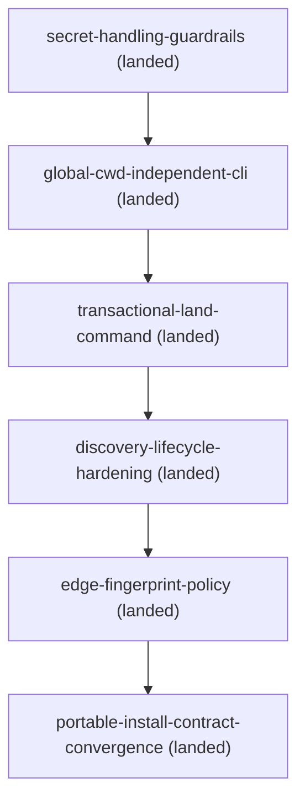

# Roadmap

## Remediation

- `docs/changes/archive/2026-07-23-secret-handling-guardrails/` (landed) — scanner and redacted
  diagnostics
- `docs/changes/archive/2026-07-23-global-cwd-independent-cli/` (landed) — packaged resolver with an
  explicit, fail-closed CLI; depends on the landed secret-handling guardrails
- `docs/changes/archive/2026-07-23-transactional-land-command/` (landed) — one resumable dry-runnable operation for
  preflight, archive, stamping, roadmap regeneration, and validation; depends on the packaged CLI
- `docs/changes/archive/2026-07-23-discovery-lifecycle-hardening/` (landed) — tracked/declared discovery, explicit
  untracked opt-in, root-node policy, repository-relative classification, actionable hash states,
  and baseline-vs-new warning reporting; depends on the landed transactional land command
- `docs/changes/archive/2026-07-23-edge-fingerprint-policy/` (landed) — make dependency fingerprints advisory by
  default while retaining strict frozen-document `self_hash`; depends on the landed discovery and
  lifecycle hardening change
- `docs/changes/archive/2026-07-23-portable-install-contract-convergence/` — templates and install guidance now use
  `.doc-contract.toml` plus the packaged/vendored CLI, with sync-to-check proven in a clean
  temporary repository; depends on the landed edge-fingerprint policy

<!-- BEGIN GENERATED DAG (regenerate: doc-contract update --repo-root .) -->

<!-- END GENERATED DAG -->
