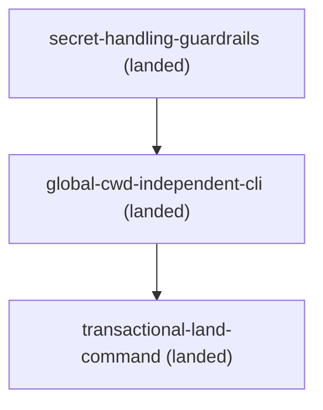

# Roadmap

## Remediation

- `docs/changes/archive/2026-07-23-secret-handling-guardrails/` (landed) — scanner and redacted
  diagnostics
- `docs/changes/archive/2026-07-23-global-cwd-independent-cli/` (landed) — packaged resolver with an
  explicit, fail-closed CLI; depends on the landed secret-handling guardrails
- `docs/changes/archive/2026-07-23-transactional-land-command/` (landed) — one resumable dry-runnable operation for
  preflight, archive, stamping, roadmap regeneration, and validation; depends on the packaged CLI

<!-- BEGIN GENERATED DAG (regenerate: doc-contract update --repo-root .) -->

<!-- END GENERATED DAG -->
