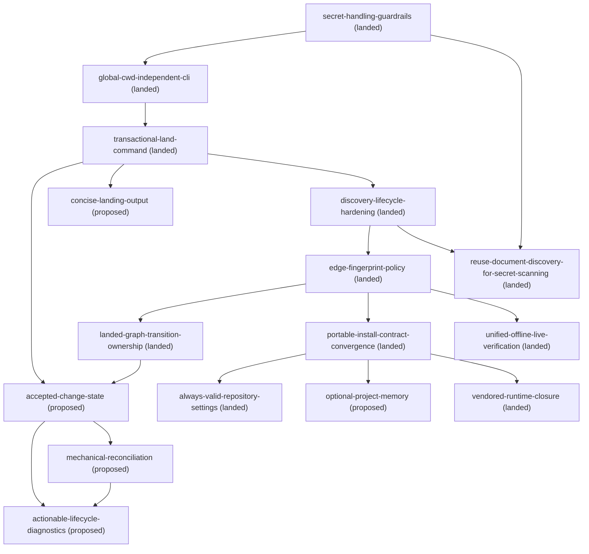

# Roadmap

## Remediation

- `docs/changes/concise-landing-output/` (proposed) — make `land` print a compact mutation inventory by default and expose the complete diff only through an explicit flag; depends on the landed transactional command
- `docs/changes/actionable-lifecycle-diagnostics/` (proposed) — give acceptance, start, mechanical reconciliation, and landing one stable value-free lifecycle diagnostic taxonomy; depends on accepted state and mechanical reconciliation
- `docs/changes/optional-project-memory/` (proposed) — make repository artifacts sufficient for every lifecycle phase and keep external project memory optional and explicitly authorized; depends on the landed portable install contract
- `docs/changes/archive/2026-07-27-reuse-document-discovery-for-secret-scanning/` (landed) — run document discovery once and feed its exact selected path set to both graph validation and value-free secret scanning; depends on the landed secret-handling and discovery changes
- `docs/changes/archive/2026-07-23-secret-handling-guardrails/` (landed) — scanner and redacted
  diagnostics
- `docs/changes/archive/2026-07-23-global-cwd-independent-cli/` (landed) — packaged resolver with an
  explicit, fail-closed CLI; depends on the landed secret-handling guardrails
- `docs/changes/archive/2026-07-23-transactional-land-command/` (landed) — one resumable dry-runnable operation for
  preflight, archive, stamping, roadmap regeneration, and validation; depends on the packaged CLI
- `docs/changes/archive/2026-07-23-discovery-lifecycle-hardening/` (landed) — tracked/declared discovery, explicit
  untracked opt-in, root-node policy, repository-relative classification, actionable hash states,
  and baseline-vs-new warning reporting; depends on the landed transactional land command
- `docs/changes/archive/2026-07-23-edge-fingerprint-policy/` (landed) — make dependency fingerprints advisory by
  default while retaining strict frozen-document `self_hash`; depends on the landed discovery and
  lifecycle hardening change
- `docs/changes/archive/2026-07-23-portable-install-contract-convergence/` — templates and install guidance now use
  `.doc-contract.toml` plus the packaged/vendored CLI, with sync-to-check proven in a clean
  temporary repository; depends on the landed edge-fingerprint policy

## Architecture

- `docs/changes/accepted-change-state/` (proposed) — add explicit `accepted`, `accept`, and `begin` transitions, reusable transactional lifecycle planning, and in-progress-only landing; depends on the landed transaction and graph-projection boundaries
- `docs/changes/archive/2026-07-24-landed-graph-transition-ownership/` (landed) — move projected landed document
  state, topology, roadmap rendering, and validation behind one resolver-owned operation; depends on
  the landed edge-fingerprint policy
- `docs/changes/archive/2026-07-24-unified-offline-live-verification/` (landed) — consolidate check and landing
  capability policy, redacted execution, status/finding mapping, and warning composition behind one
  internal verification operation; depends on the landed edge-fingerprint policy
- `docs/changes/archive/2026-07-24-always-valid-repository-settings/` (landed) — make every direct or TOML-backed
  settings construction enforce the same immutable repository invariants; depends on the landed
  portable install contract convergence
- `docs/changes/archive/2026-07-24-vendored-runtime-closure/` (landed) — make sync materialize one deterministic,
  complete runtime image whose isolated launcher and manifest share the installed package identity;
  depends on the landed portable install contract convergence

## Lifecycle

- `docs/changes/mechanical-reconciliation/` (proposed) — add a read-only packaged reconciliation report that reuses lifecycle and landing plans while leaving semantic judgment to the skill; depends on accepted state

<!-- BEGIN GENERATED DAG (regenerate: doc-contract update --repo-root .) -->

<!-- END GENERATED DAG -->
